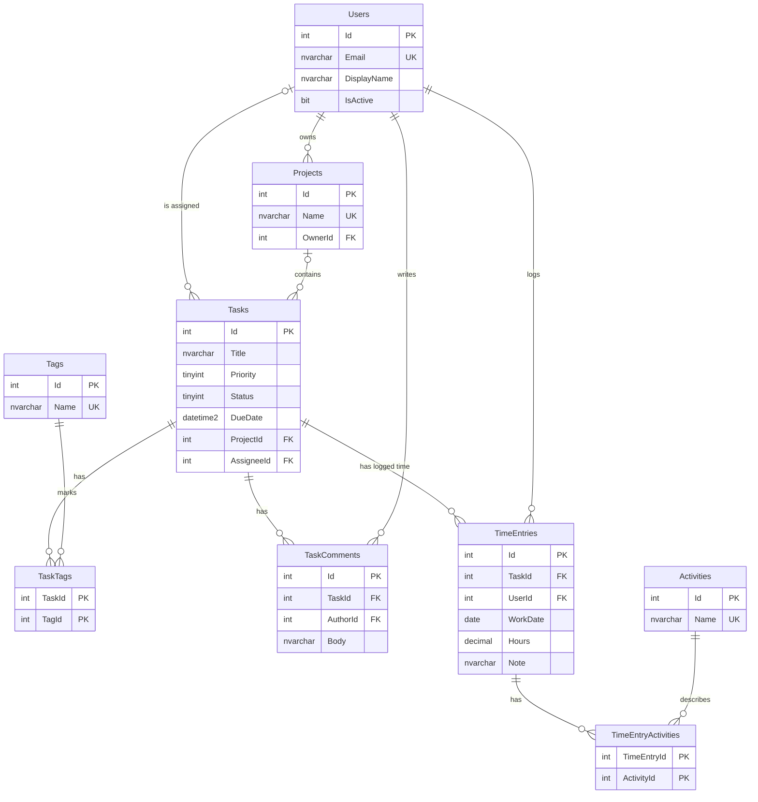

# ERD TaskFlowLab

```mermaid
erDiagram
    Users ||--o{ Projects : "owns"
    Users |o--o{ Tasks : "is assigned"
    Projects |o--o{ Tasks : "contains"
    Tasks ||--o{ TaskTags : "has"
    Tags ||--o{ TaskTags : "marks"
    Tasks ||--o{ TaskComments : "has"
    Users ||--o{ TaskComments : "writes"
    Tasks ||--o{ TimeEntries : "has logged time"
    Users ||--o{ TimeEntries : "logs"
    TimeEntries ||--o{ TimeEntryActivities : "has"
    Activities ||--o{ TimeEntryActivities : "describes"

    Users {
        int Id PK
        nvarchar Email UK
        nvarchar DisplayName
        bit IsActive
    }
    Projects {
        int Id PK
        nvarchar Name UK
        int OwnerId FK
    }
    Tasks {
        int Id PK
        nvarchar Title
        tinyint Priority
        tinyint Status
        datetime2 DueDate
        int ProjectId FK
        int AssigneeId FK
    }
    Tags {
        int Id PK
        nvarchar Name UK
    }
    TaskTags {
        int TaskId PK
        int TagId PK
    }
    TaskComments {
        int Id PK
        int TaskId FK
        int AuthorId FK
        nvarchar Body
    }
    TimeEntries {
        int Id PK
        int TaskId FK
        int UserId FK
        date WorkDate
        decimal Hours
        nvarchar Note
    }
    Activities {
        int Id PK
        nvarchar Name UK
    }
    TimeEntryActivities {
        int TimeEntryId PK
        int ActivityId PK
    }
```
